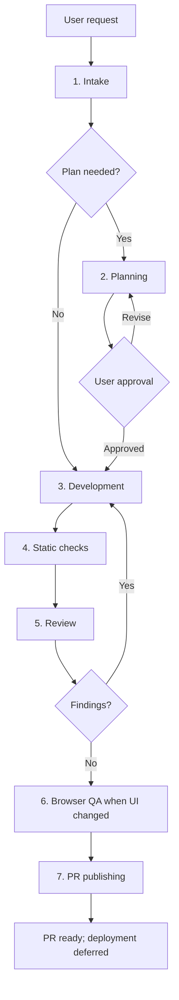

# DDC NL Agent Loop

This skill coordinates DDC NL WordPress theme work from request to pull request. It keeps deployment outside the loop until a project deploy contract exists.

## Standing Inputs

Before every loop, read:

- `AGENTS.md` for repository guardrails.
- `README.md` for local setup, secrets, media, and GitHub context.
- `CONTEXT.md` before changing public copy, template names, page names, labels, or domain terms.

Treat `AGENTS.md` as the source of truth when another `.agents/` file disagrees with it.

## Flow

## Coordinator Rules

The coordinator owns orchestration, status, review, and publishing. During the development phase, delegate code edits to a development subagent when subagents are available. If subagents are unavailable, perform the same loop directly and keep task boundaries small.

Work incrementally. Keep unrelated refactors, slug changes, template renames, asset churn, and media changes out of scope unless the request requires them.

## 1. Intake

Classify the request:

- **Tiny:** obvious one-file or copy/config change. Skip written planning and execute a tight loop.
- **Standard:** feature or bugfix touching several files. Use planning.
- **Risky:** public copy, templates, forms, Telegram integration, release work, checkout/enrollment paths, or broad styling. Use planning and browser QA.

Check:

- Current branch and worktree: `git status --short --branch`.
- Whether existing user changes overlap the task.
- Whether `images/`, `videos/`, secrets, or ignored files are implicated.

Completion criterion: scope, risks, and required skills are known.

## 2. Planning

Use `planning-and-task-breakdown` for Standard and Risky work. Save:

- `tasks/plan.md`
- `tasks/todo.md`

Plans must include DDC NL verification commands, likely files, acceptance criteria, and whether browser QA is required. Ask for user approval before implementation when a plan file is created.

Completion criterion: every task is small, ordered, testable, and approved.

## 3. Development

Use `tdd` for feature and bugfix logic. Choose public seams from the project surface:

- PHP template output.
- WordPress hooks, filters, shortcodes, or form handlers.
- Project JavaScript behavior in `js/`.
- SCSS/CSS behavior verified by rendered pages when automated tests are not available.

For each task:

1. Create or update the narrowest meaningful test/check first when the repo supports it.
2. Implement only the current task.
3. Run the task verification.
4. Mark the task complete in `tasks/todo.md` when present.

Completion criterion: the task is implemented, locally checked, and represented accurately in `tasks/todo.md`.

## 4. Static Checks

Run checks matched to changed files:

- PHP: `php -l` for each changed PHP file.
- JS: `node --check` for changed project JS files, excluding third-party minified libraries.
- Styles: confirm source and built CSS stay aligned when style changes touch generated files.
- Brand scan: search for legacy branding tokens without storing them in docs.
- Secret/media scan: ensure staged files do not include secrets, `.env`, `.DS_Store`, `node_modules/`, `images/`, or `videos/`.

Completion criterion: every relevant check passes or the remaining failure is documented as a blocker.

## 5. Review

Use `code-review` against `origin/main...HEAD` by default unless the user names another fixed point. Review both:

- **Standards:** `AGENTS.md`, local conventions, security/media rules, and code smells.
- **Spec:** the user request plus any `tasks/plan.md` acceptance criteria.

If review finds actionable issues, return to Development with the report and rerun checks.

Completion criterion: review reports no blocking Standards or Spec findings.

## 6. Browser QA

Use `e2e-test` when UI, templates, forms, front-end JS, or CSS changed. Prefer local WordPress/XAMPP pages and verify desktop and mobile viewports when layout is touched.

Completion criterion: changed user-facing flows render without obvious broken layout, PHP warnings, console errors, or failed core interactions.

## 7. PR Publishing

Use `pull-request` for branch, commit, push, and PR creation. Publishing stops at the PR unless the user explicitly requests a release or deployment.

Before PR:

- Run `git status --short --branch`.
- Inspect staged and unstaged diffs.
- Reconfirm no secrets/private media are staged.
- Use Conventional Commits.
- Do not add AI attribution trailers.

Completion criterion: the PR URL is returned to the user, or authentication/network failure is reported with the exact next step.

## Deployment

Deployment is intentionally deferred. Add a DDC NL deploy contract before enabling deploy automation. That contract should define production URL, release command, hosting mechanism, rollback strategy, required approvals, and post-deploy smoke tests.
